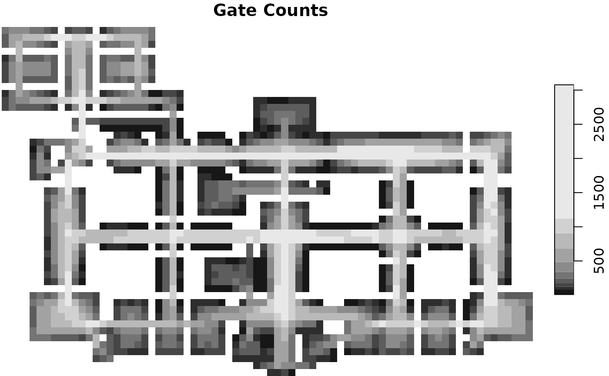
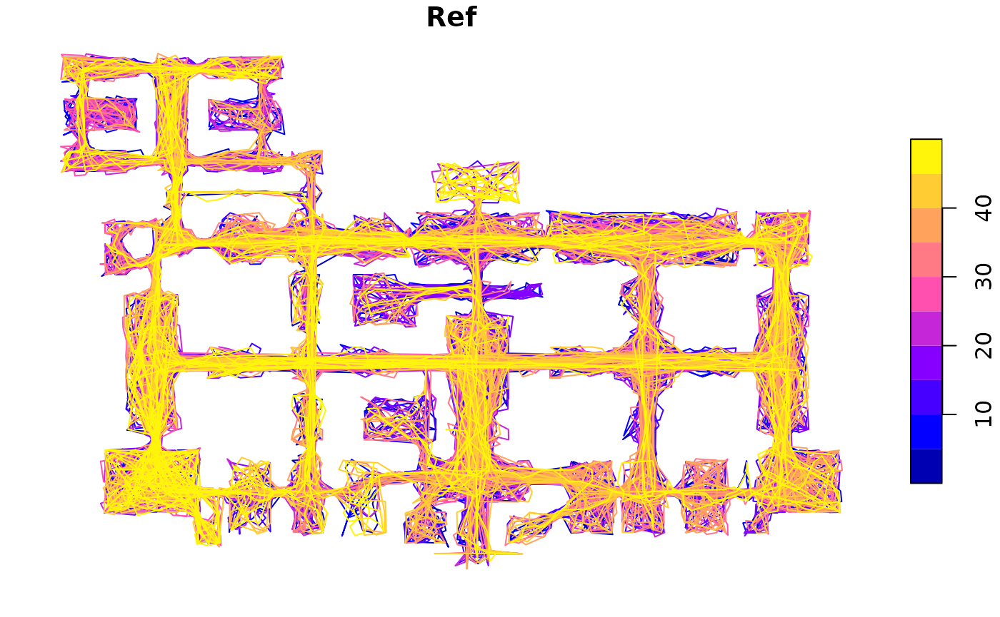

# Agent Analysis

``` r

library(alcyon)
#> Loading required package: sf
#> Linking to GEOS 3.12.1, GDAL 3.8.4, PROJ 9.4.0; sf_use_s2() is TRUE
#> Loading required package: stars
#> Loading required package: abind

galleryMap <- st_read(
    system.file(
        "extdata", "testdata", "gallery",
        "gallery_lines.mif",
        package = "alcyon"
    ),
    geometry_column = 1L, quiet = TRUE
)
```

``` r

latticeMap <- makeVGALatticeMap(
    galleryMap,
    fillX = 3.01,
    fillY = 6.7,
    gridSize = 0.06
)
plot(latticeMap["Connectivity"])
```


``` r

agentAnalysis <- agentAnalysis(latticeMap,
    timesteps = 10000,
    releaseRate = 0.1,
    agentLifeTimesteps = 1000,
    agentFov = 16,
    agentStepsToDecision = 3,
    agentLookMode = AgentLookMode$Standard
)
plot(agentAnalysis$latticeMap["Gate Counts"])
```



``` r

agentAnalysis <- agentAnalysis(latticeMap,
    timesteps = 10000,
    releaseRate = 0.1,
    agentLifeTimesteps = 1000,
    agentFov = 16,
    agentStepsToDecision = 3,
    agentLookMode = AgentLookMode$Standard,
    numberOfTrails = 50
)
plot(agentAnalysis$trailMap)
```


