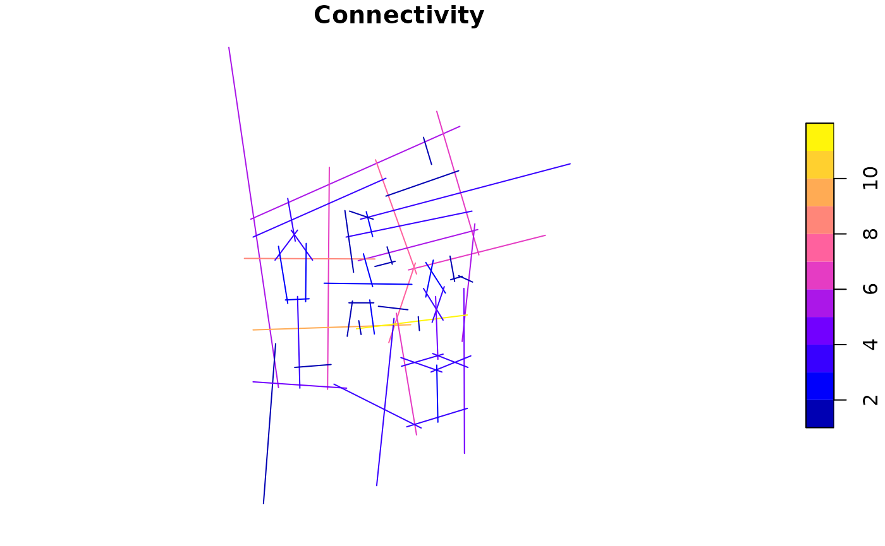
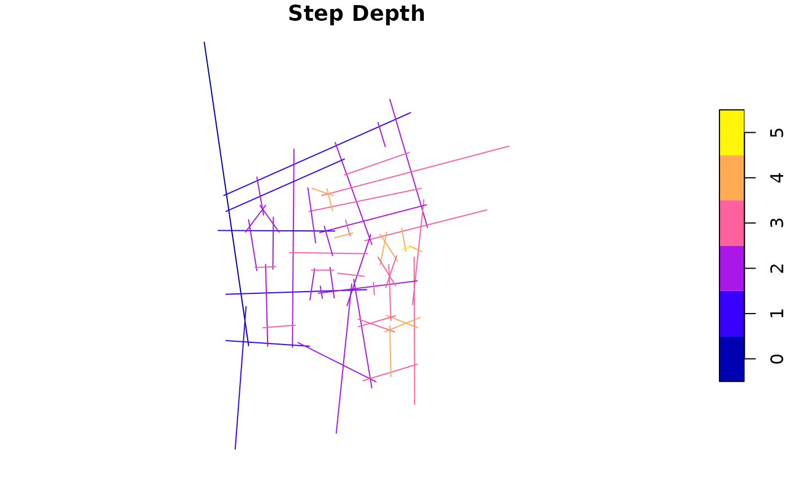

# Axial Analysis

``` r

library(alcyon)
#> Loading required package: sf
#> Linking to GEOS 3.12.1, GDAL 3.8.4, PROJ 9.4.0; sf_use_s2() is TRUE
#> Loading required package: stars
#> Loading required package: abind

lineStringMap <- st_read(
    system.file(
        "extdata", "testdata", "barnsbury", "barnsbury_small_axial_original.mif",
        package = "alcyon"
    ),
    geometry_column = 1L, quiet = TRUE
)
axMap <- as(lineStringMap, "AxialShapeGraph")
```

``` r

plot(axMap[, "Connectivity"])
```



``` r

axAnalysed <- allToAllTraverse(
    axMap,
    traversalType = TraversalType$Topological,
    radii = c("n", "3"),
    includeBetweenness = TRUE
)
plot(axAnalysed[, "Choice [Norm] R3"])
```


``` r

axAnalysed <- oneToAllTraverse(
    axAnalysed,
    traversalType = TraversalType$Topological,
    fromX = 0982.8,
    fromY = -1620.3,
)
plot(axAnalysed["Step Depth"])
```


