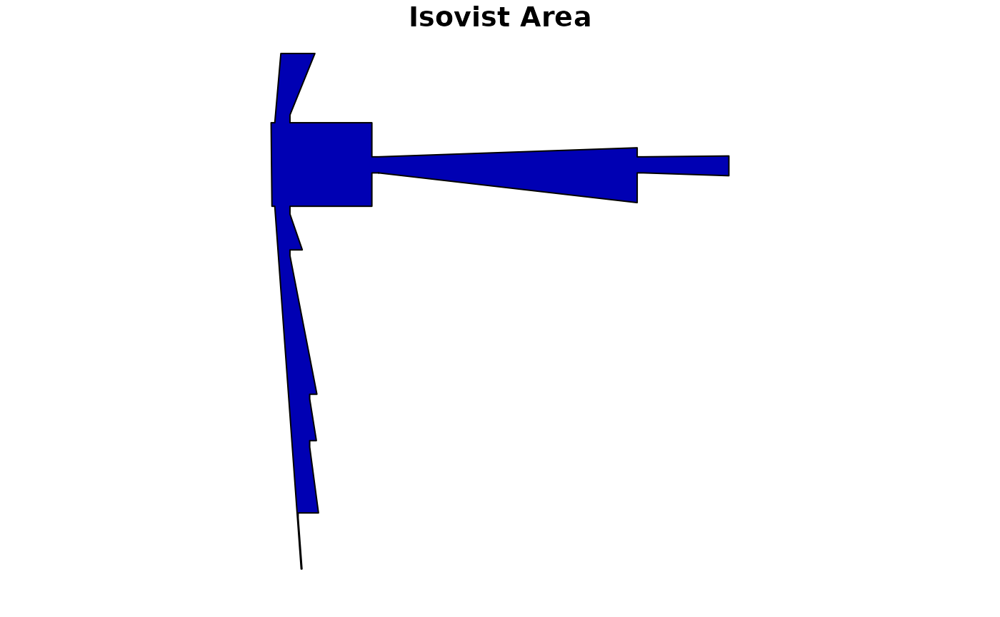

# Isovists

``` r

library(alcyon)
#> Loading required package: sf
#> Linking to GEOS 3.12.1, GDAL 3.8.4, PROJ 9.4.0; sf_use_s2() is TRUE
#> Loading required package: stars
#> Loading required package: abind

lineStringMap <- st_read(
    system.file(
        "extdata", "testdata", "gallery",
        "gallery_lines.mif",
        package = "alcyon"
    ),
    geometry_column = 1L, quiet = TRUE
)

shapeMap <- as(lineStringMap[, vector()], "ShapeMap")
```

``` r

isovistMap <- isovist(
    shapeMap,
    x = c(3.01),
    y = c(6.70),
    angle = 0.01,
    viewAngle = 3.14,
    FALSE
)
```

``` r

plot(isovistMap[1, 1])
```


