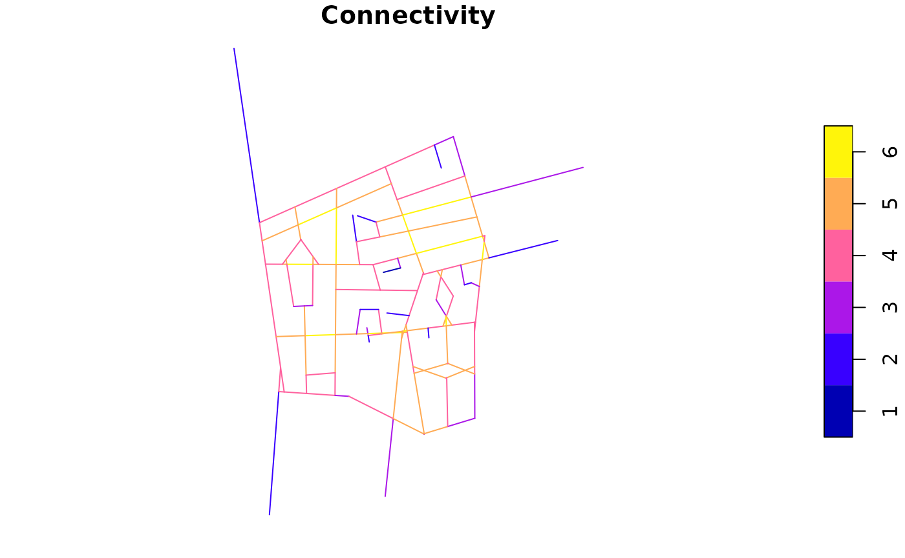
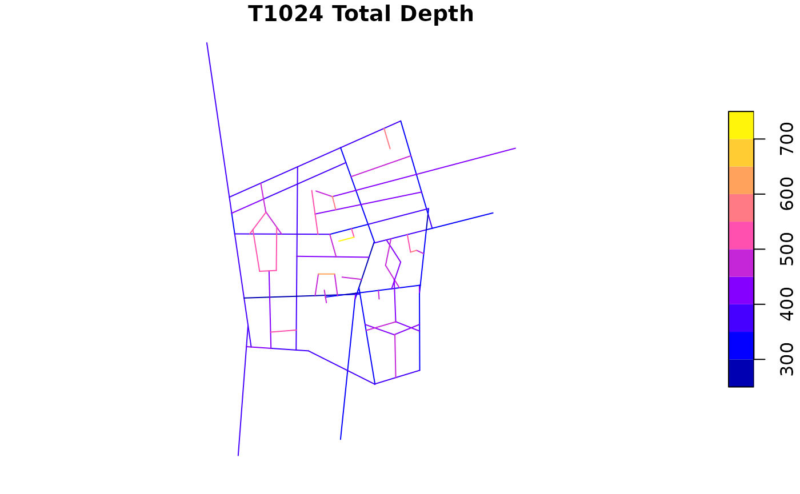
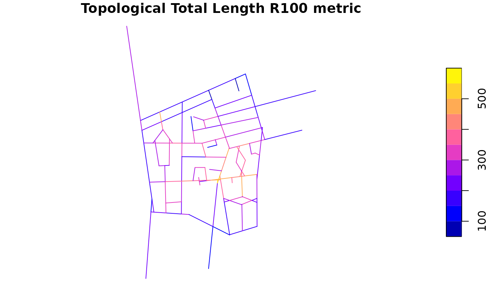
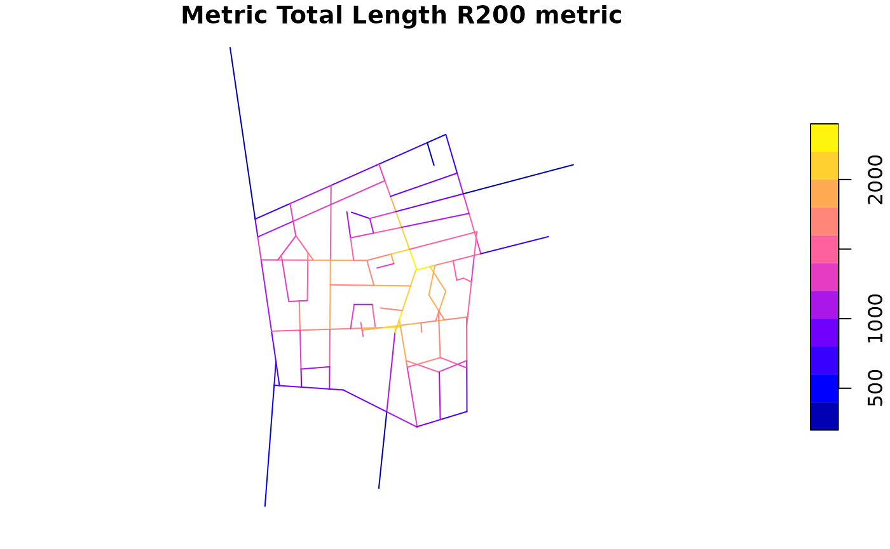
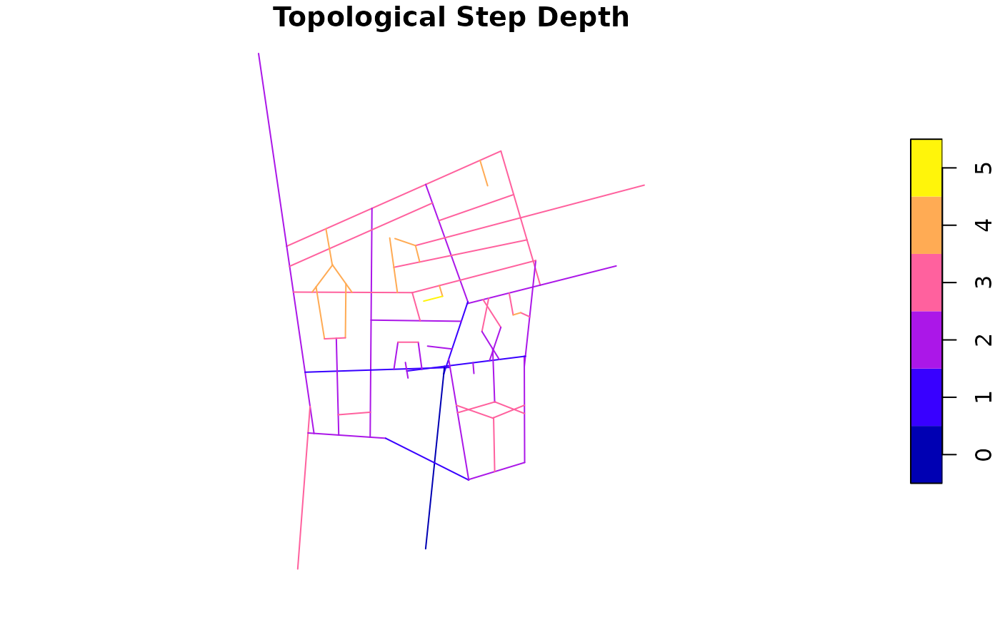
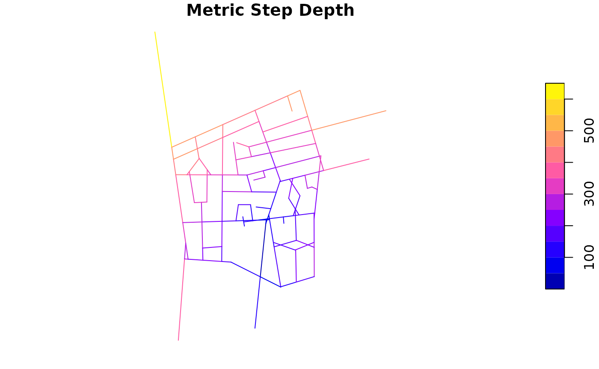
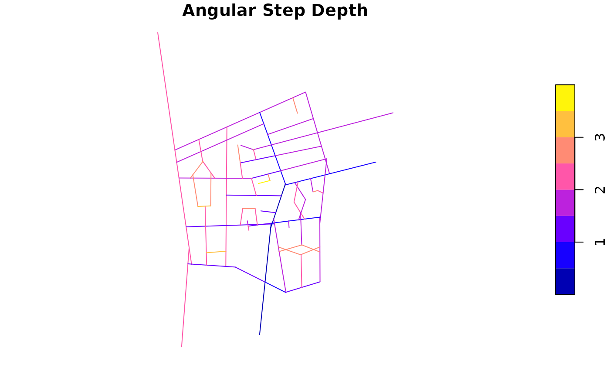
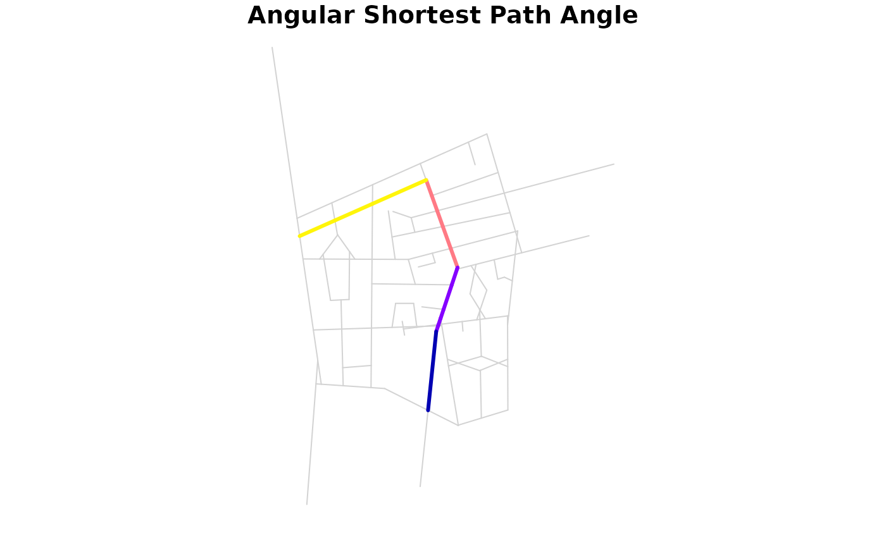
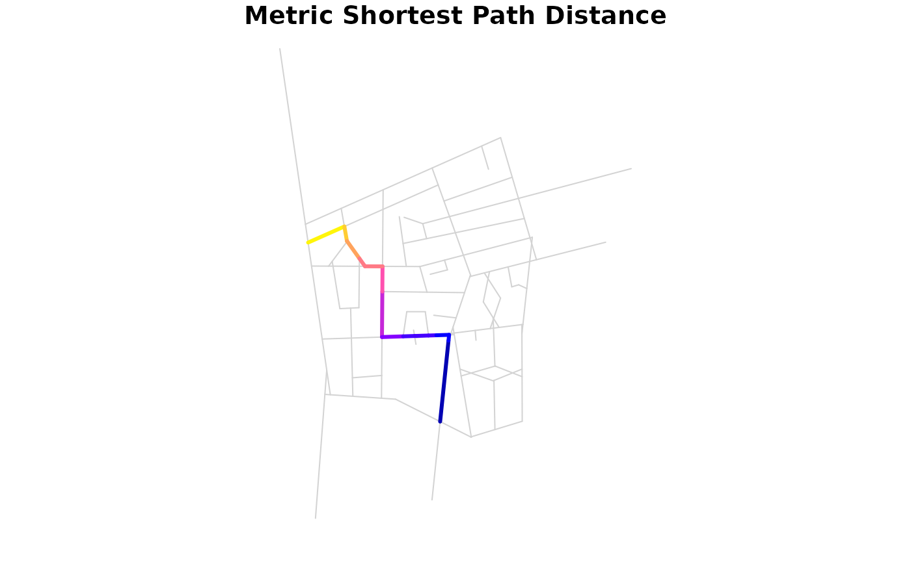
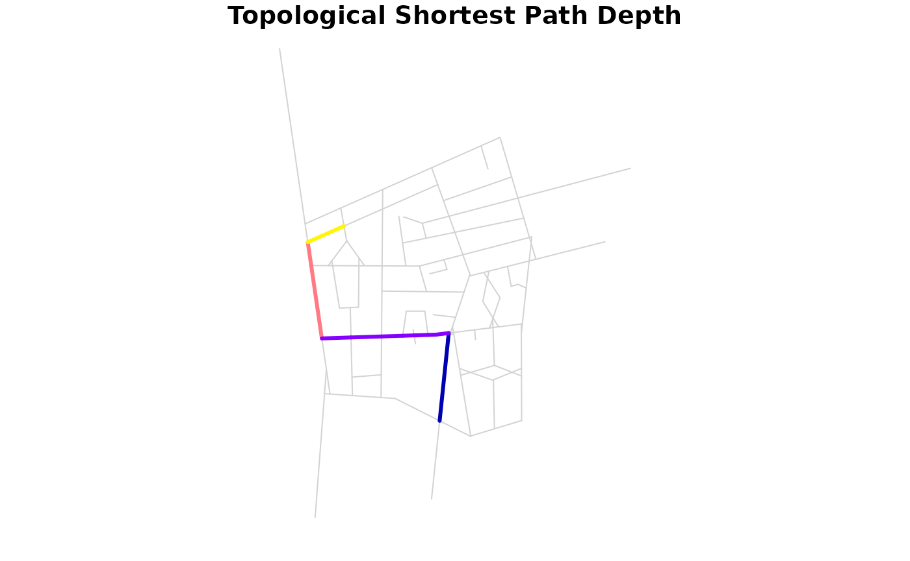

# Segment Analysis

``` r
library(alcyon)
#> Loading required package: sf
#> Linking to GEOS 3.12.1, GDAL 3.8.4, PROJ 9.4.0; sf_use_s2() is TRUE
#> Loading required package: stars
#> Loading required package: abind

lineStringMap <- st_read(
    system.file(
        "extdata", "testdata", "barnsbury", "barnsbury_small_axial_original.mif",
        package = "alcyon"
    ),
    geometry_column = 1L, quiet = TRUE
)
axialShapeGraph <- as(lineStringMap, "AxialShapeGraph")
segMap <- axialToSegmentShapeGraph(
    axialShapeGraph,
    stubRemoval = 0.4
)
```

``` r
plot(segMap[, "Connectivity"])
```



``` r
segmentAnalysed <- allToAllTraverse(
    segMap,
    radii = c("n", "200"),
    radiusTraversalType = TraversalType$Metric,
    traversalType = TraversalType$Angular,
    quantizationWidth = pi / 1024,
    includeBetweenness = FALSE
)
plot(segmentAnalysed[, "T1024 Total Depth"])
```



``` r
segmentAnalysed <- allToAllTraverse(
    segmentAnalysed,
    radii = c("n", "100"),
    radiusTraversalType = TraversalType$Topological,
    traversalType = TraversalType$Topological,
    includeBetweenness = FALSE
)
plot(segmentAnalysed[, "Topological Total Length R100 metric"])
```



``` r
segmentResult <- allToAllTraverse(
    segmentAnalysed,
    radii = c("n", "200"),
    radiusTraversalType = TraversalType$Metric,
    traversalType = TraversalType$Metric,
    includeBetweenness = FALSE
)
plot(segmentResult[, "Metric Total Length R200 metric"])
```



``` r
segmentAnalysed <- oneToAllTraverse(
    segmentAnalysed,
    traversalType = TraversalType$Topological,
    fromX = 1217.1,
    fromY = -1977.3
)

plot(segmentAnalysed[, "Topological Step Depth"])
```



``` r
segmentAnalysed <- oneToAllTraverse(
    segmentAnalysed,
    traversalType = TraversalType$Metric,
    fromX = 1217.1,
    fromY = -1977.3
)

plot(segmentAnalysed[, "Metric Step Depth"])
```



``` r
segmentAnalysed <- oneToAllTraverse(
    segmentAnalysed,
    traversalType = TraversalType$Angular,
    fromX = 1217.1,
    fromY = -1977.3,
    quantizationWidth = pi / 1024
)

plot(segmentAnalysed[, "Angular Step Depth"])
```



``` r
segmentAnalysed <- oneToOneTraverse(
    segmentAnalysed,
    traversalType = TraversalType$Angular,
    fromX = 1217.1,
    fromY = -1977.3,
    toX = 1017.8,
    toY = -1699.3,
    quantizationWidth = pi / 1024
)
column <- "Angular Shortest Path Angle"
plot(segmentAnalysed[, column],
    col = "lightgray", reset = FALSE
)
plot(segmentAnalysed[
    unlist(segmentAnalysed[column]) >= 0,
    column
], lwd = 3, add = TRUE)
```



``` r
segmentAnalysed <- oneToOneTraverse(
    segmentAnalysed,
    traversalType = TraversalType$Metric,
    fromX = 1217.1,
    fromY = -1977.3,
    toX = 1017.8,
    toY = -1699.3,
    quantizationWidth = pi / 1024
)
column <- "Metric Shortest Path Distance"
plot(segmentAnalysed[, column],
    col = "lightgray", reset = FALSE
)
plot(segmentAnalysed[
    unlist(segmentAnalysed[column]) >= 0,
    column
], lwd = 3, add = TRUE)
```



``` r
segmentAnalysed <- oneToOneTraverse(
    segmentAnalysed,
    traversalType = TraversalType$Topological,
    fromX = 1217.1,
    fromY = -1977.3,
    toX = 1017.8,
    toY = -1699.3,
    quantizationWidth = pi / 1024
)
column <- "Topological Shortest Path Depth"
plot(segmentAnalysed[, column],
    col = "lightgray", reset = FALSE
)
plot(segmentAnalysed[
    unlist(segmentAnalysed[column]) >= 0,
    column
], lwd = 3, add = TRUE)
```


