# Visibility Graph Analysis

``` r
library(alcyon)
#> Loading required package: sf
#> Linking to GEOS 3.12.1, GDAL 3.8.4, PROJ 9.4.0; sf_use_s2() is TRUE
#> Loading required package: stars
#> Loading required package: abind

galleryMap <- st_read(
    system.file(
        "extdata", "testdata", "gallery",
        "gallery_lines.mif",
        package = "alcyon"
    ),
    geometry_column = 1L, quiet = TRUE
)
```

``` r
latticeMap <- makeVGALatticeMap(
    galleryMap,
    fillX = 3.01,
    fillY = 6.7,
    gridSize = 0.06
)
plot(latticeMap["Connectivity"])
```


``` r
linkedLatticeMap <- linkCoords(latticeMap, 1.74, 6.7, 5.05, 5.24)
```

``` r
vgaMap <- allToAllTraverse(
    latticeMap,
    traversalType = TraversalType$Metric,
    radii = -1,
    radiusTraversalType = TraversalType$None
)
plot(vgaMap["Metric Mean Shortest-Path Angle"])
```

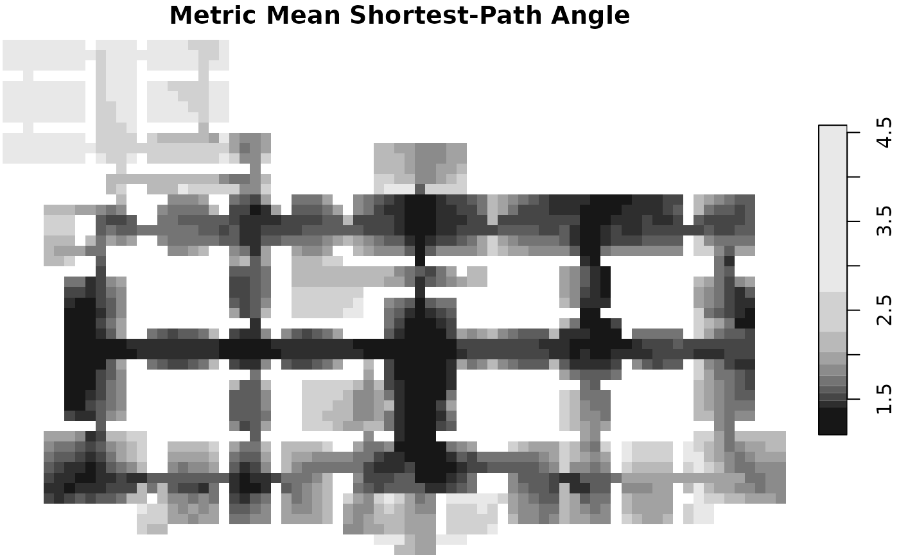

``` r
vgaMap <- allToAllTraverse(
    vgaMap,
    traversalType = TraversalType$Angular,
    radii = -1,
    radiusTraversalType = TraversalType$None
)

plot(vgaMap["Angular Mean Depth"])
```

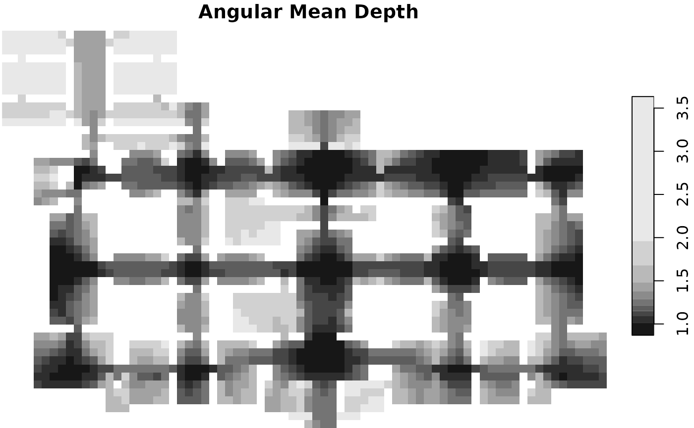

``` r
vgaMap <- allToAllTraverse(
    vgaMap,
    traversalType = TraversalType$Topological,
    radii = -1,
    radiusTraversalType = TraversalType$None
)
plot(vgaMap["Visual Integration [HH]"])
```

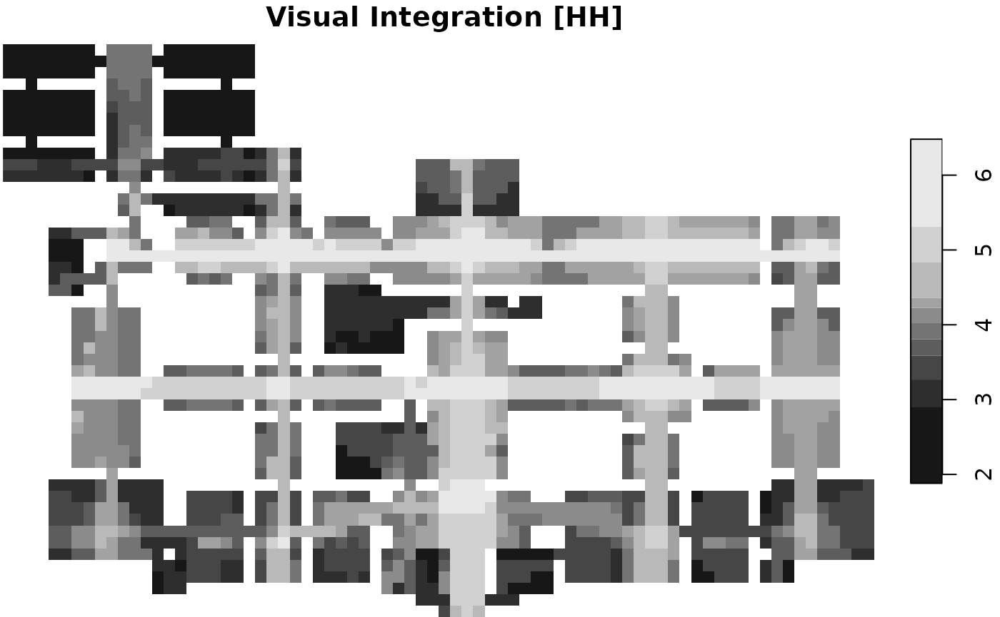

``` r
vgaMap <- vgaThroughVision(vgaMap)
plot(vgaMap["Through vision"])
```

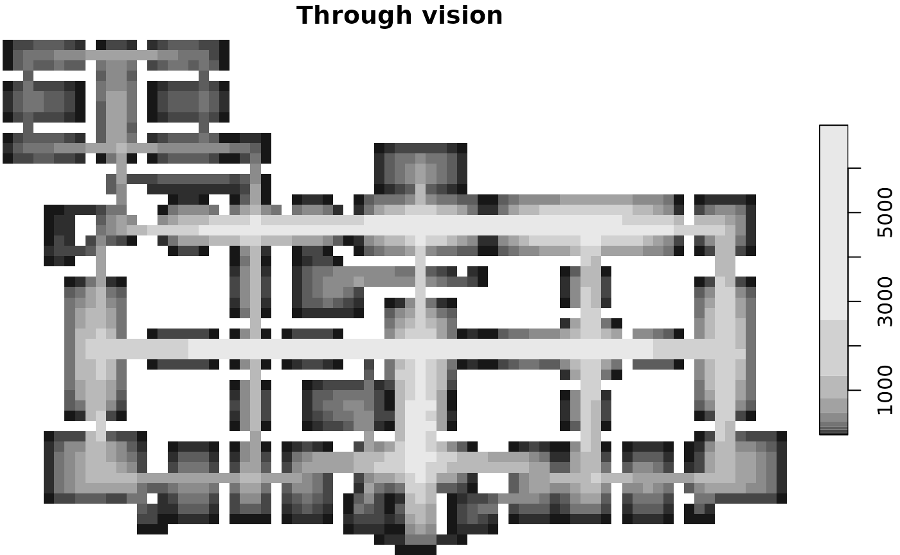

``` r
vgaMap <- vgaVisualLocal(vgaMap, FALSE)
plot(vgaMap["Visual Control"])
```

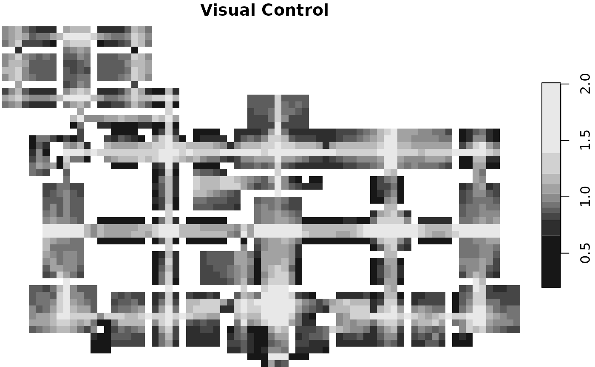

``` r
boundaryMap <- as(galleryMap[, vector()], "ShapeMap")
vgaMap <- vgaIsovist(vgaMap, boundaryMap)
plot(vgaMap["Isovist Area"])
```

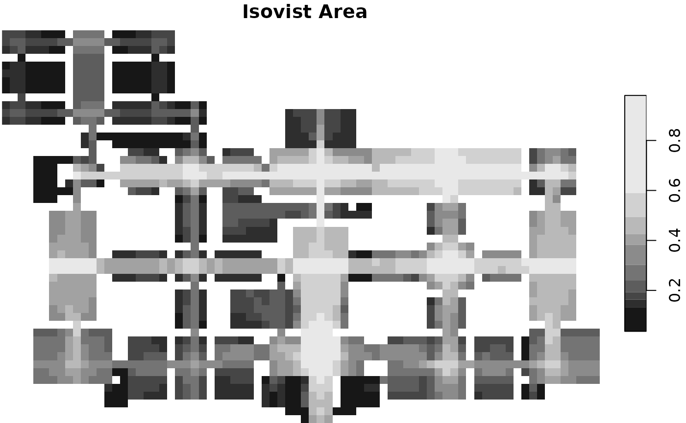

``` r
vgaMap <- oneToAllTraverse(
    vgaMap,
    traversalType = TraversalType$Metric,
    fromX = 3.01,
    fromY = 6.7
)
plot(vgaMap["Metric Step Shortest-Path Angle"])
```

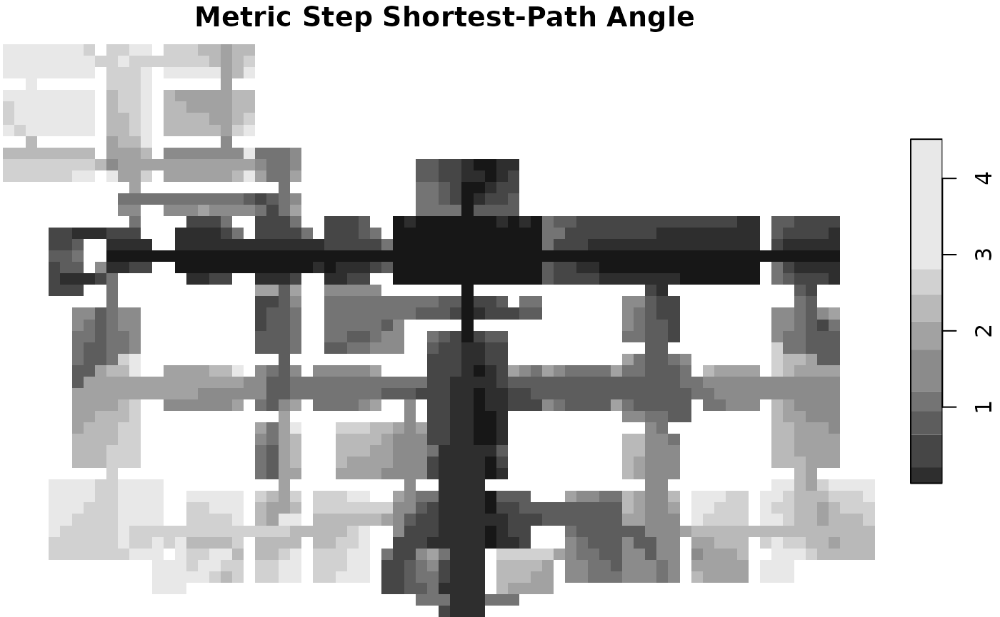

``` r
vgaMap <- oneToAllTraverse(
    vgaMap,
    traversalType = TraversalType$Angular,
    fromX = 3.01,
    fromY = 6.7
)
plot(vgaMap["Angular Step Depth"])
```

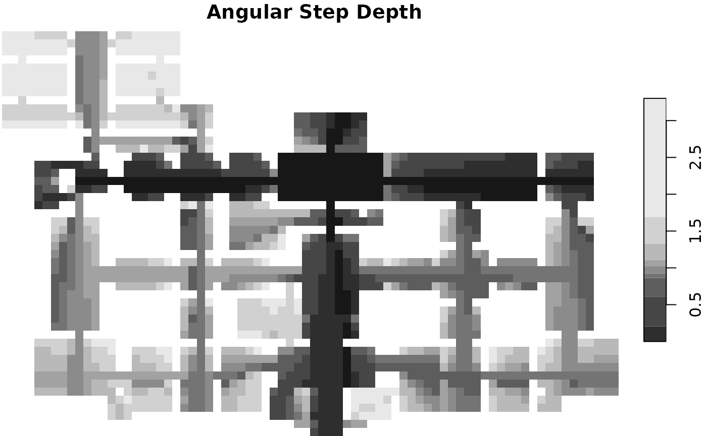

``` r
vgaMap <- oneToAllTraverse(
    vgaMap,
    traversalType = TraversalType$Topological,
    fromX = 3.01,
    fromY = 6.7
)
plot(vgaMap["Visual Step Depth"])
```

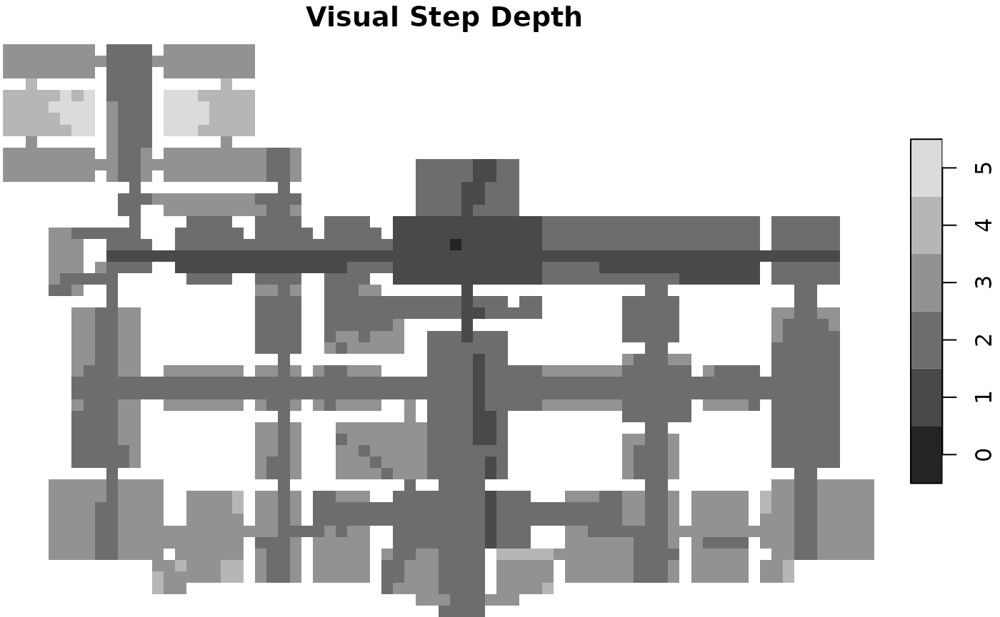

``` r
vgaMap <- oneToOneTraverse(
    vgaMap,
    traversalType = TraversalType$Topological,
    fromX = 4.86,
    fromY = 5.25,
    toX = 1.27,
    toY = 7.60
)
nuv <- length(unique(unlist(vgaMap["Visual Shortest Path"])))
plot(vgaMap["Visual Shortest Path"],
    breaks = "equal",
    nbreaks = nuv,
    col = c("lightgray", depthmap.axmanesque.colour(nuv - 2))
)
```

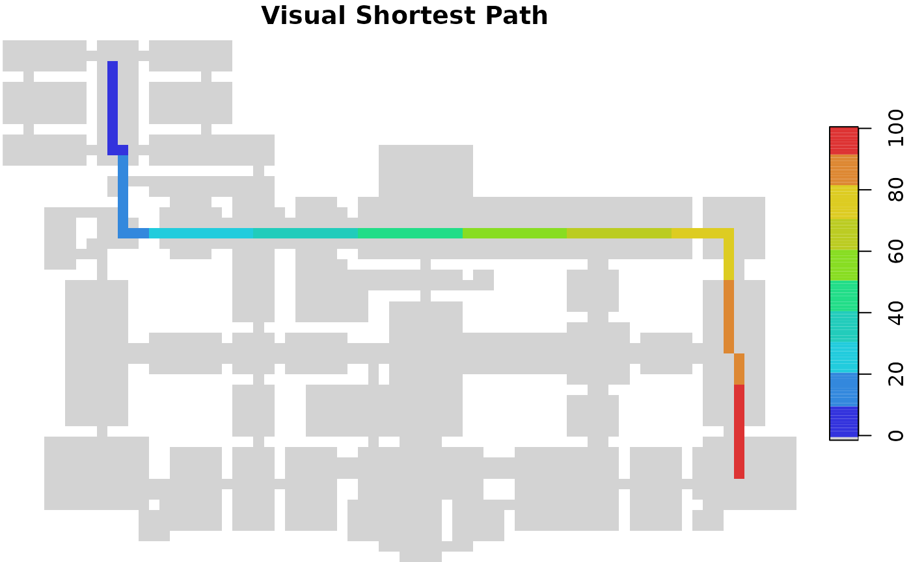

``` r
vgaMap <- oneToOneTraverse(
    vgaMap,
    traversalType = TraversalType$Topological,
    fromX = 4.86,
    fromY = 5.25,
    toX = 1.27,
    toY = 7.60
)
nuv <- length(unique(unlist(vgaMap["Visual Shortest Path Visual Zone"])))
plot(vgaMap["Visual Shortest Path Visual Zone"],
    breaks = "equal",
    nbreaks = nuv,
    col = c("lightgray", depthmap.axmanesque.colour(nuv - 2))
)
```

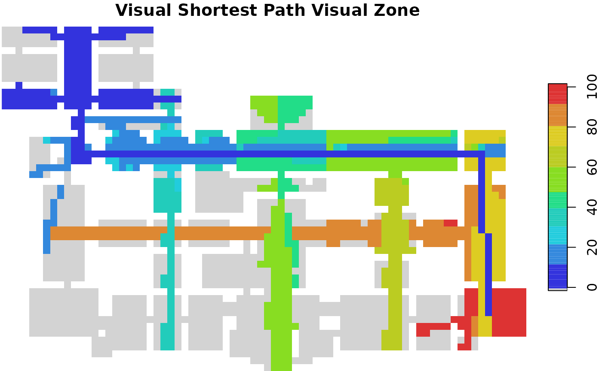

``` r
vgaMap <- oneToOneTraverse(
    vgaMap,
    traversalType = TraversalType$Metric,
    fromX = 4.86,
    fromY = 5.25,
    toX = 1.27,
    toY = 7.60
)
nuv <- length(unique(unlist(vgaMap["Metric Shortest Path"])))
plot(vgaMap["Metric Shortest Path"],
    breaks = "equal",
    nbreaks = nuv,
    col = c("lightgray", depthmap.axmanesque.colour(nuv - 2))
)
```

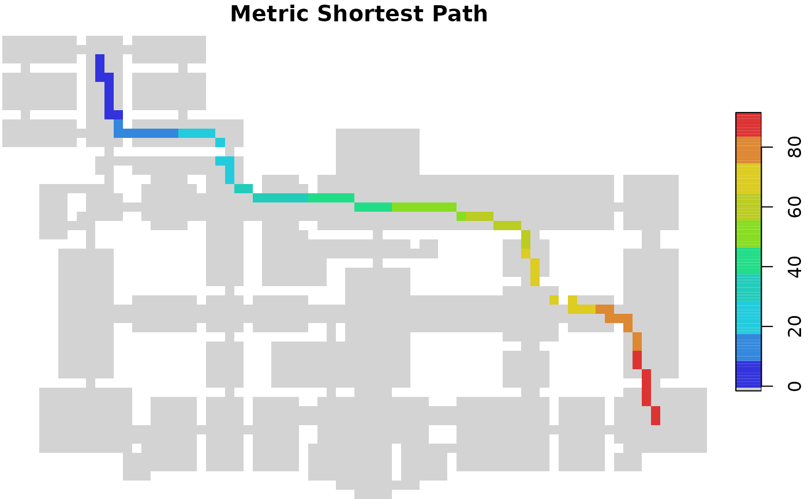

``` r
vgaMap <- oneToOneTraverse(
    vgaMap,
    traversalType = TraversalType$Angular,
    fromX = 4.86,
    fromY = 5.25,
    toX = 1.27,
    toY = 7.60
)
nuv <- length(unique(unlist(vgaMap["Angular Shortest Path"])))
plot(vgaMap["Angular Shortest Path"],
    breaks = "equal",
    nbreaks = nuv,
    col = c("lightgray", depthmap.axmanesque.colour(nuv - 2))
)
```


``` r
vgaMap <- oneToOneTraverse(
    vgaMap,
    traversalType = TraversalType$Angular,
    fromX = 4.86,
    fromY = 5.25,
    toX = 1.27,
    toY = 7.60
)
nuv <- length(unique(unlist(vgaMap["Angular Shortest Path Metric Zone"])))
plot(vgaMap["Angular Shortest Path Metric Zone"],
    breaks = "equal",
    nbreaks = nuv,
    col = c("lightgray", depthmap.classic.colour(nuv - 2))
)
```

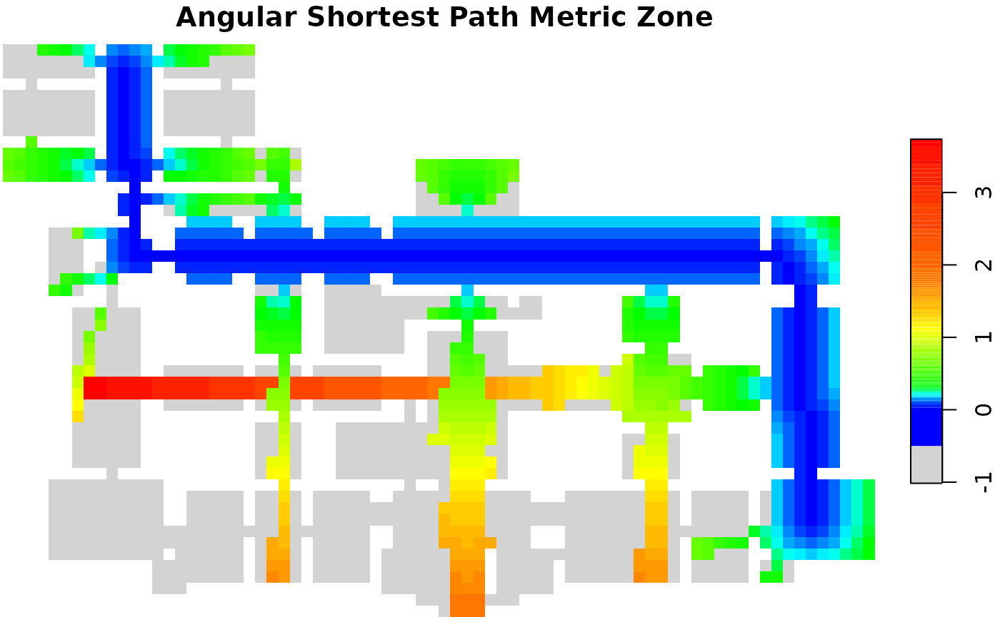
